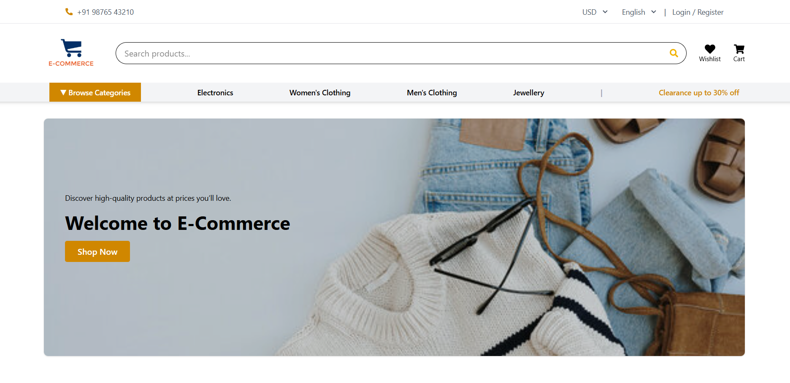
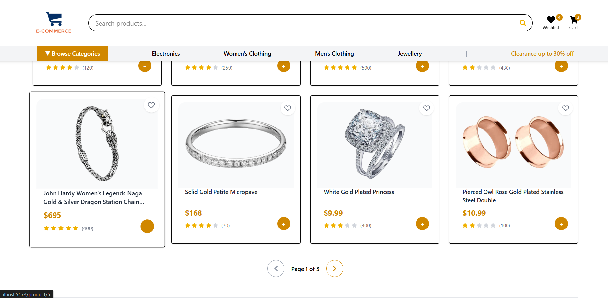
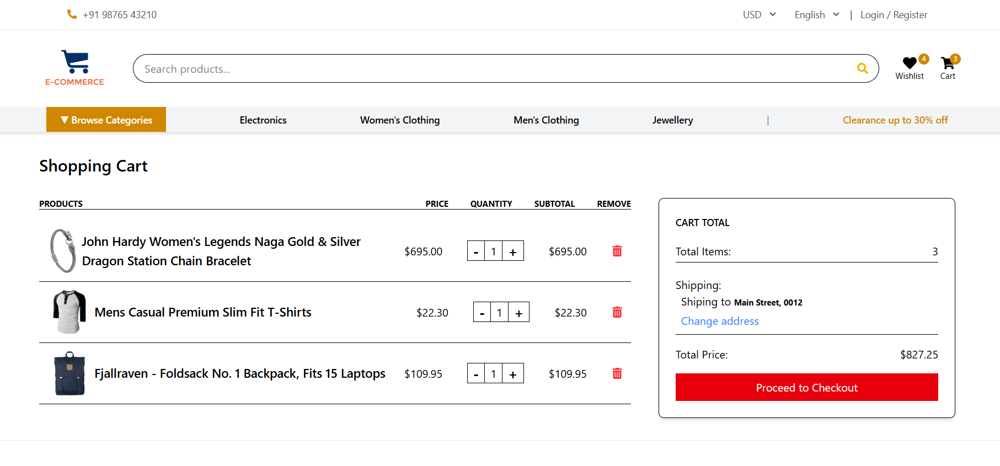
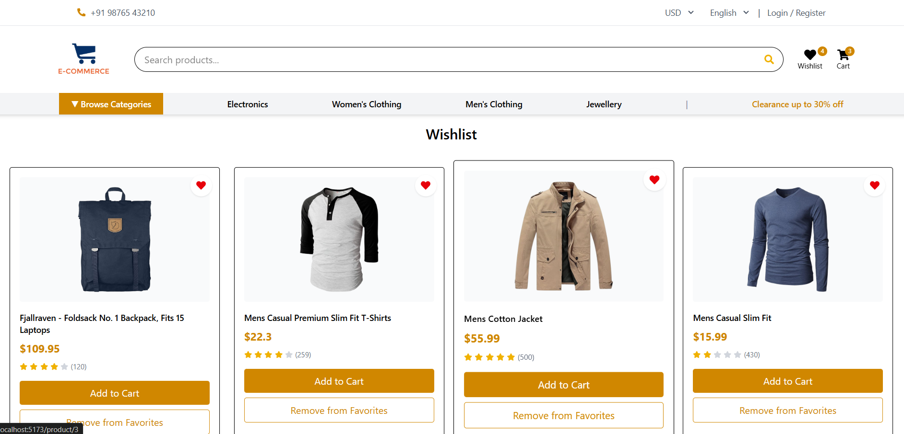
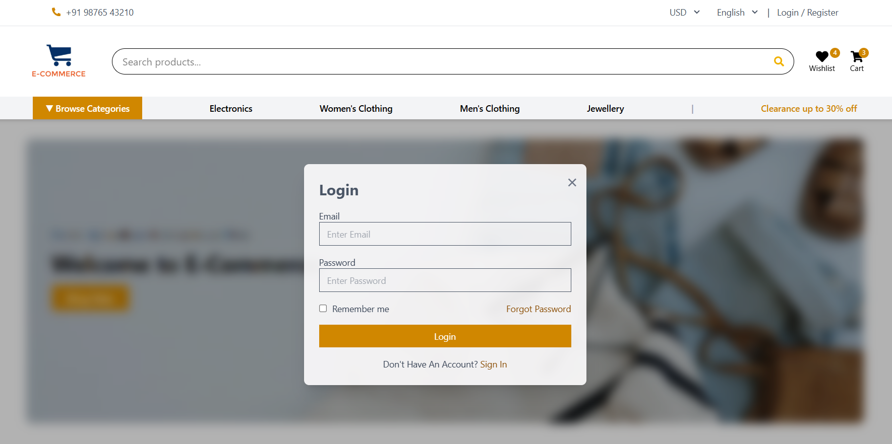
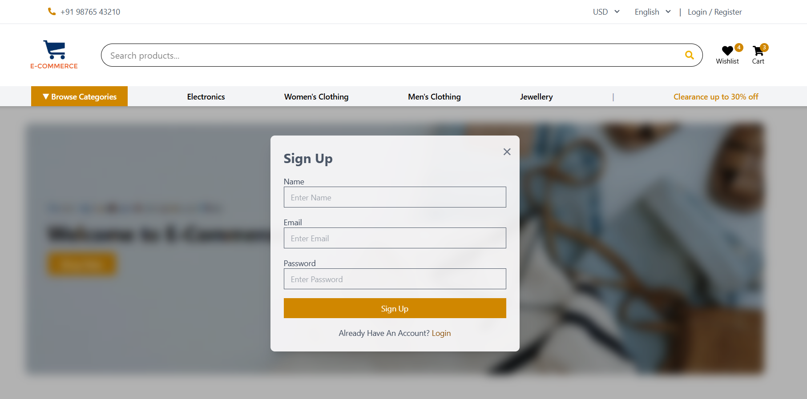

# 🛒 E-Commerce Web Application

## 📌 Project Description
This is a fully responsive **E-Commerce web application** built using **React**.  
The application allows users to browse products, search items, add products to the cart, manage favorites, and interact with a modern and user-friendly interface.

The project focuses on **reusable components, clean UI design, and efficient state management** using Redux Toolkit.

---

## 🚀 Features
- Category-wise product browsing
- Product search functionality
- Add / remove products from cart
- Cart quantity management
- Wishlist (favorites) feature
- Product pagination
- Login and Register modal
- Product ratings display
- Fully responsive design

---

## 📸 Screenshots

### Home Page


### Product Listing


### Cart Page


### Favorites Page


### Login / Register Modal




---

## 🧑‍💻 Tech Stack
- React
- JavaScript (ES6)
- Redux Toolkit
- React Router DOM
- Tailwind CSS
- Vite
- React Icons

---

## 📂 Project Structure
```
project-root/
│── src/
│   ├── components/
│   ├── pages/
│   ├── redux/
│   │   ├── store.js
│   │   ├── cartSlice.js
│   │   ├── FavSlice.js
│   │   └── productSlice.js
│   ├── assets/
│   ├── App.jsx
│   └── main.jsx
│── screenshots/
│── public/
│── package.json
│── vite.config.js
│── README.md
```

---

## ⚙️ Installation

1. Clone the repository
 ```bash
   git clone https://github.com/AparnaNale/almabetter-ecommerce

2. Install dependencies-

  npm install

3.   Run the project-

  npm run dev

## 👩‍💻 Author

### Aparna Nale
Frontend Developer | React
📧 Email: aparna.nale099@gmail.com